# 🖼️ Zen AI Pentest - Project Presentation

This document contains the visual overview of the Zen AI Pentest framework, its architecture, and core capabilities.

---

### 01. Overview & Key Highlights
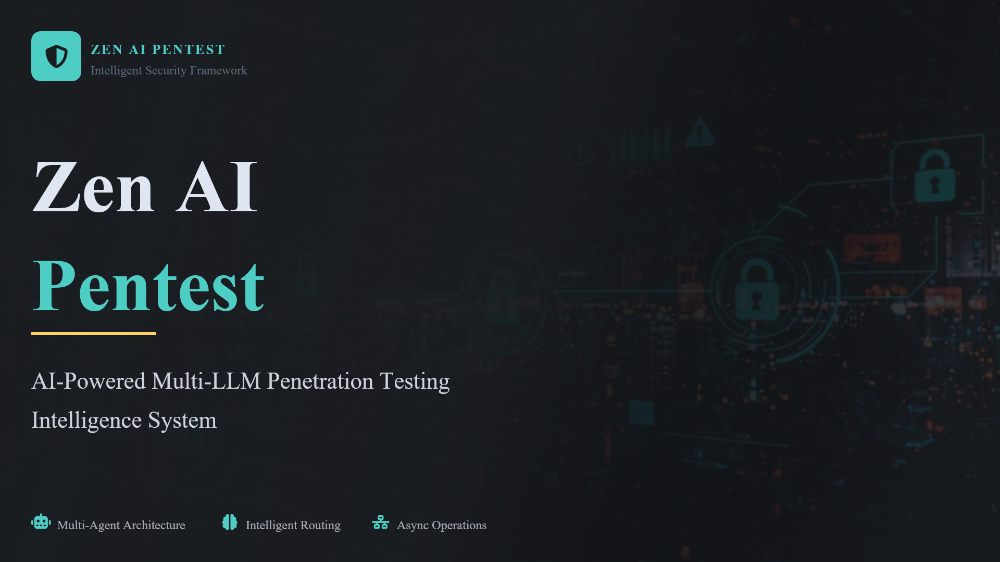

### 02. Presentation Overview
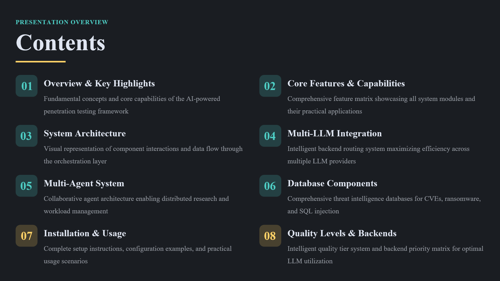

### 03. Framework Introduction
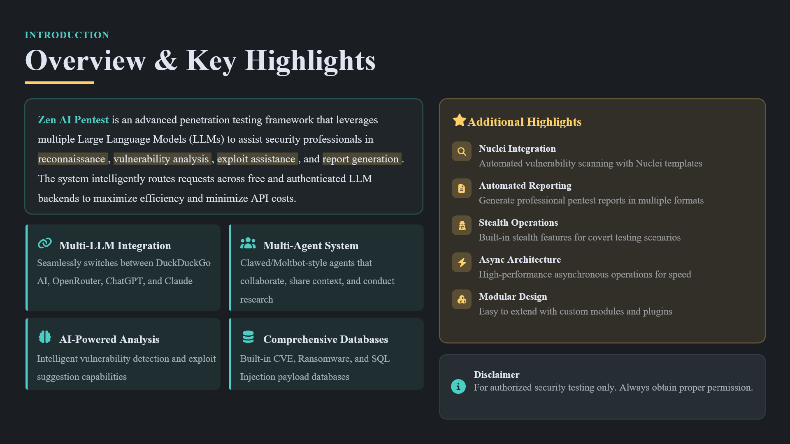

### 04. Core Features & Capabilities
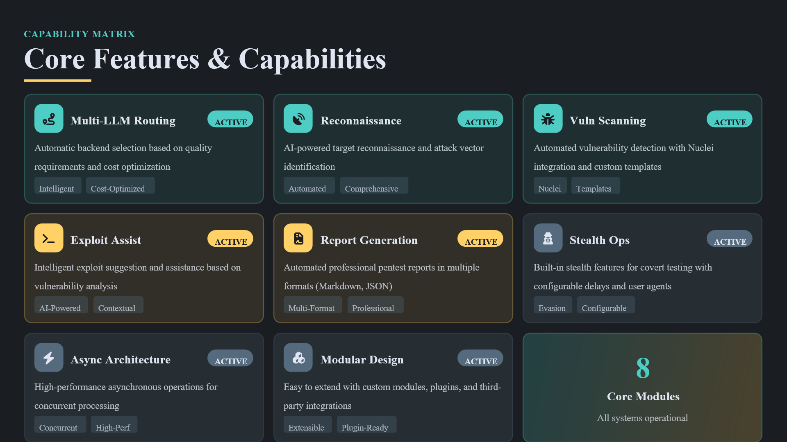

### 05. System Architecture
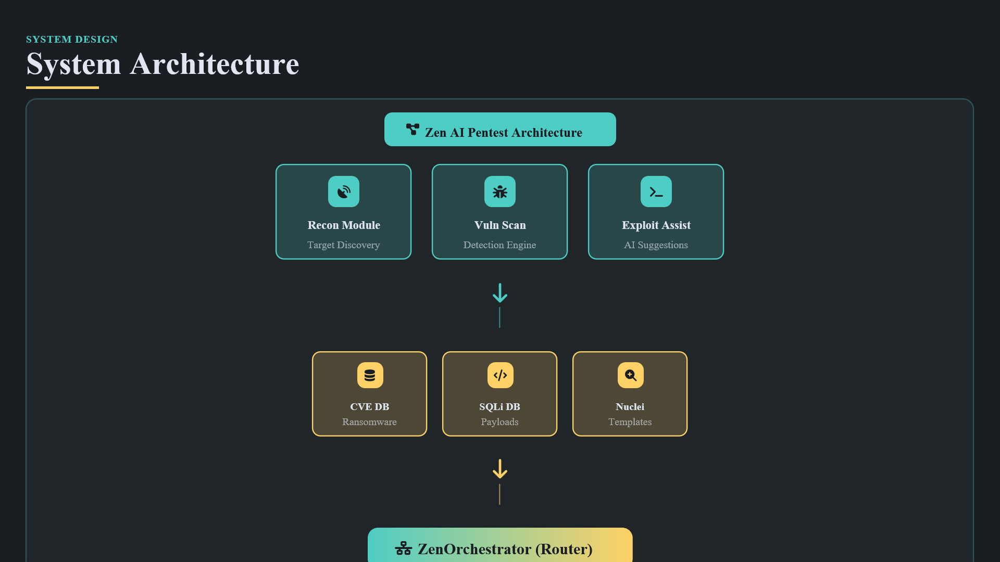

### 06. Multi-LLM Integration Strategy
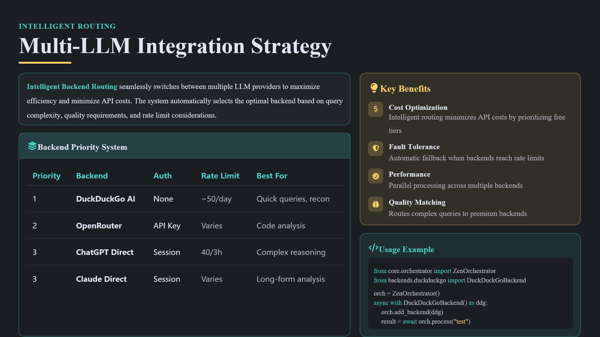

### 07. Multi-Agent System
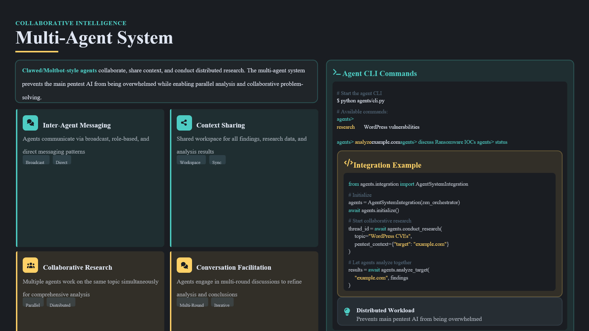

### 08. CVE & Ransomware Database
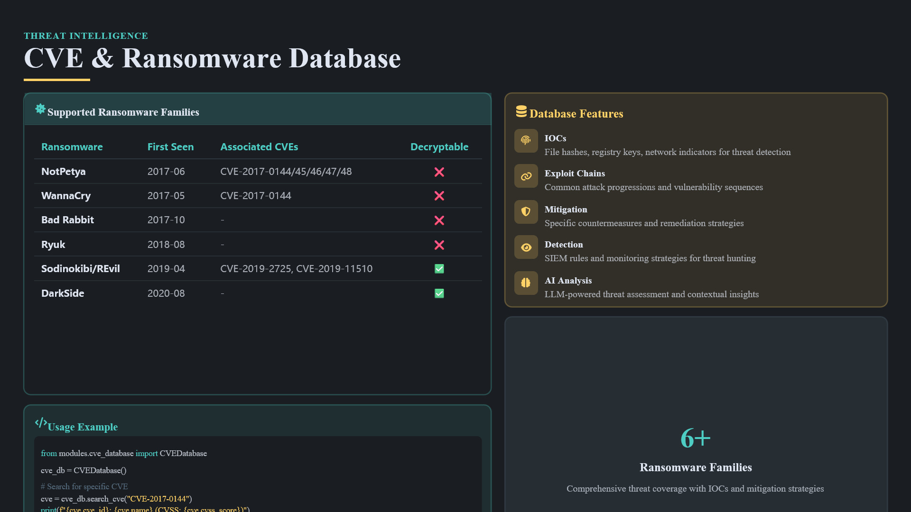

### 09. SQL Injection Database
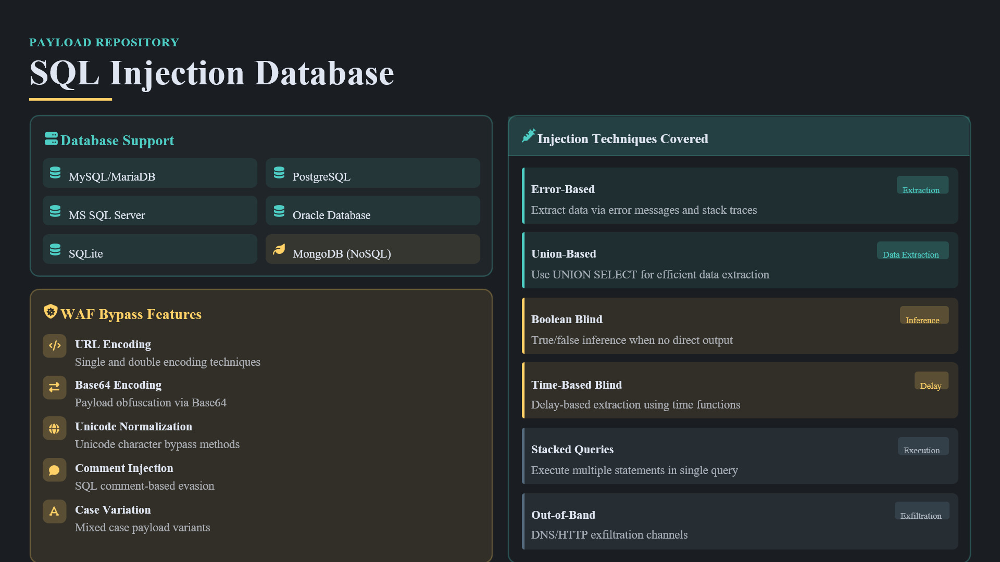

### 10. Nuclei Integration & WordPress Templates
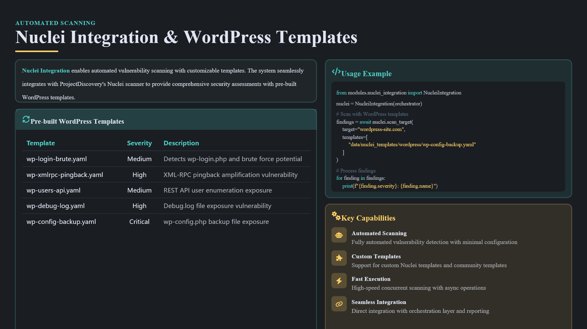

### 11. Installation, Configuration & Usage
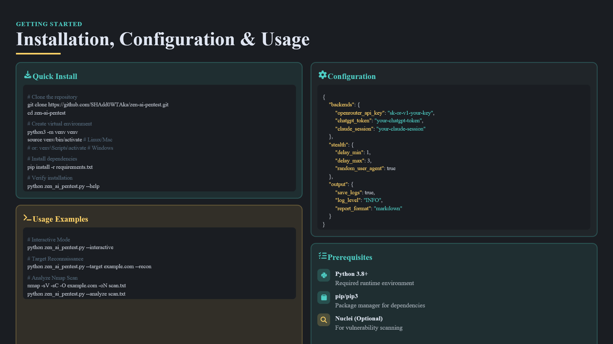

### 12. Quality Levels & Backend Priority
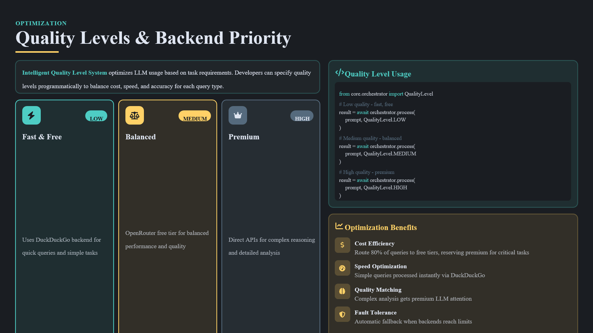

### 13. Summary
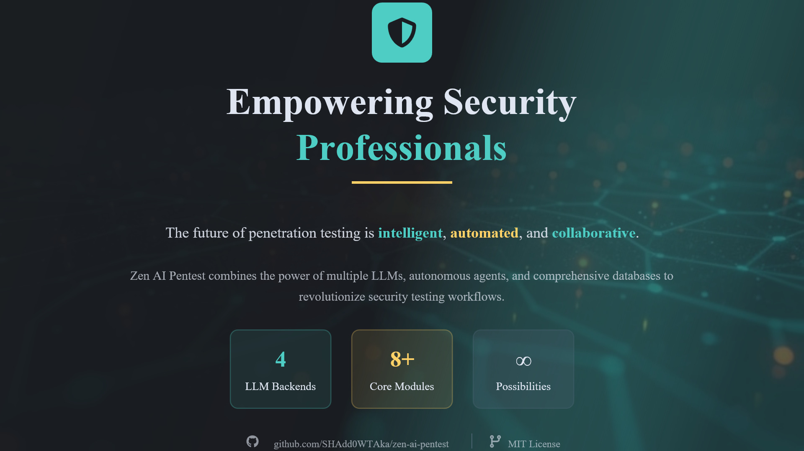

---
© 2026 SHAdd0WTAka | Zen AI Pentest
