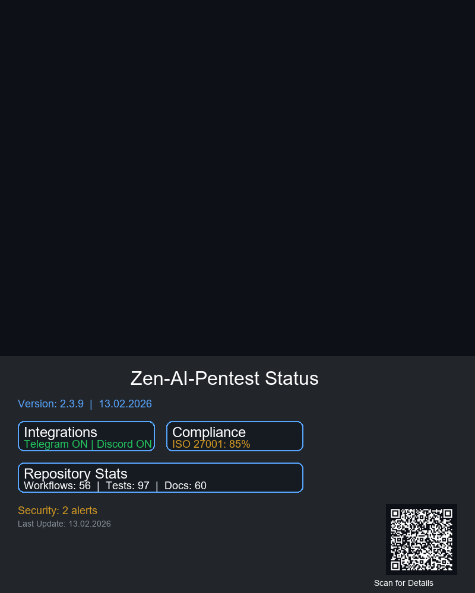
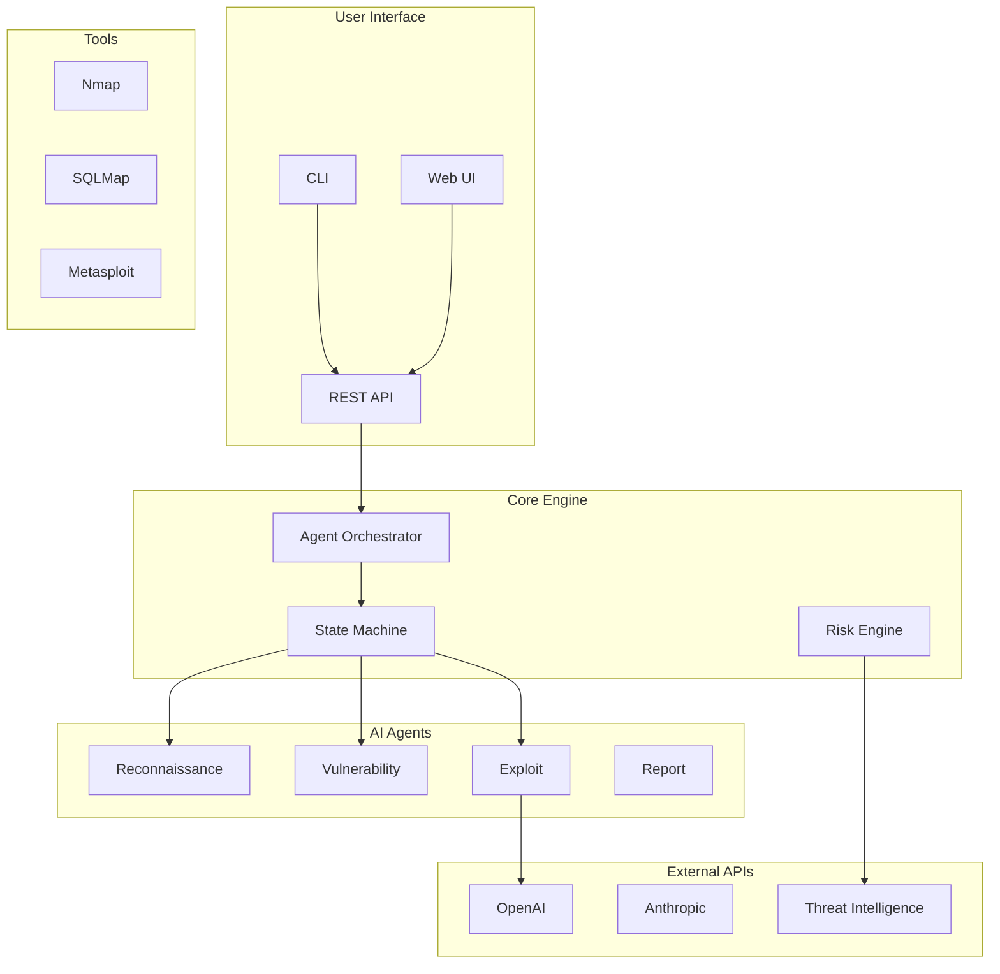
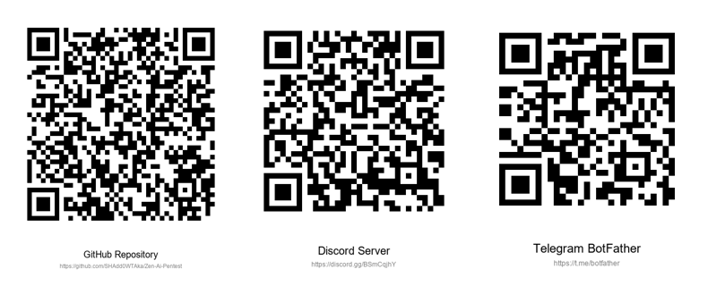

# Zen-AI-Pentest




> 🛡️ **Professional AI-Powered Penetration Testing Framework**

[](https://github.com/SHAdd0WTAka/zen-ai-pentest/releases)
[](https://python.org)
[](https://fastapi.tiangolo.com)
[](LICENSE)
[](https://pypi.org/project/zen-ai-pentest/)
[](docker/)
[](https://github.com/SHAdd0WTAka/Zen-Ai-Pentest/actions/workflows/ci.yml)
[](https://github.com/SHAdd0WTAka/Zen-Ai-Pentest/actions/workflows/security.yml)
[](https://codecov.io/gh/SHAdd0WTAka/zen-ai-pentest)
[](https://github.com/SHAdd0WTAka/Zen-Ai-Pentest/actions/workflows/ci.yml)
[](.pre-commit-config.yaml)
[](docs/compliance/iso27001/)
[](https://discord.gg/BSmCqjhY)
[](https://www.bestpractices.dev/projects/10336)
[](https://github.com/astral-sh/ruff)
[](ROADMAP_2026.md)
[](https://github.com/SHAdd0WTAka/Zen-Ai-Pentest#architecture)

---

## 📚 Table of Contents

- [Overview](#-overview)
- [Features](#-features)
- [Quick Start](#-quick-start)
- [Installation](#-installation)
- [Cloud Deployment](#-cloud-deployment)
- [Usage](#-usage)
- [API Reference](#-api-reference)
- [Troubleshooting](#-troubleshooting)
- [Architecture](#-architecture)
- [Contributing](#-contributing)
- [Support](#-support)
- [License](#-license)

---

## 🎯 Overview

**Zen-AI-Pentest** is an autonomous, AI-powered penetration testing framework that combines cutting-edge language models with professional security tools. Built for security professionals, bug bounty hunters, and enterprise security teams.



### Key Highlights

- 🤖 **AI-Powered**: Leverages state-of-the-art LLMs for intelligent decision making
- 🔒 **Security-First**: Multiple safety controls and validation layers
- 🚀 **Production-Ready**: Enterprise-grade with CI/CD, monitoring, and support
- 📊 **Comprehensive**: 20+ integrated security tools
- 🔧 **Extensible**: Plugin system for custom tools and integrations
- ☁️ **Cloud-Native**: Deploy on AWS, Azure, or GCP
- 📱 **Quick Access**: Scan QR codes for instant mobile access

<p align="center">
  <a href="docs/qr_codes/index.html">
    
  </a>
  <br>
  <sub>☝️ Click to view all QR codes or scan with your phone!</sub>
</p>

---

## ✨ Features

### 🤖 Autonomous AI Agent
- **ReAct Pattern**: Reason → Act → Observe → Reflect
- **State Machine**: IDLE → PLANNING → EXECUTING → OBSERVING → REFLECTING → COMPLETED
- **Memory System**: Short-term, long-term, and context window management
- **Tool Orchestration**: Automatic selection and execution of 20+ pentesting tools
- **Self-Correction**: Retry logic and adaptive planning
- **Human-in-the-Loop**: Optional pause for critical decisions

### 🎯 Risk Engine
- **False Positive Reduction**: Multi-factor validation with Bayesian filtering
- **Business Impact**: Financial, compliance, and reputation risk calculation
- **CVSS/EPSS Scoring**: Industry-standard vulnerability assessment
- **Priority Ranking**: Automated finding prioritization
- **LLM Voting**: Multi-model consensus for accuracy

### 🔒 Exploit Validation
- **Sandboxed Execution**: Docker-based isolated testing
- **Safety Controls**: 4-level safety system (Read-Only to Full)
- **Evidence Collection**: Screenshots, HTTP captures, PCAP
- **Chain of Custody**: Complete audit trail
- **Remediation**: Automatic fix recommendations

### 📊 Benchmarking
- **Competitor Comparison**: vs PentestGPT, AutoPentest, Manual
- **Test Scenarios**: HTB machines, OWASP WebGoat, DVWA
- **Metrics**: Time-to-find, coverage, false positive rate
- **Visual Reports**: Charts and statistical analysis
- **CI Integration**: Automated regression testing

### 🔗 CI/CD Integration
- **GitHub Actions**: Native action support
- **GitLab CI**: Pipeline integration
- **Jenkins**: Plugin and pipeline support
- **Output Formats**: JSON, JUnit XML, SARIF
- **Notifications**: Slack, JIRA, Email alerts
- **Exit Codes**: Pipeline-friendly status codes

### 🛠️ 20+ Integrated Tools
| Category | Tools |
|----------|-------|
| **Network** | Nmap, Masscan, Scapy, Tshark |
| **Web** | BurpSuite, SQLMap, Gobuster, OWASP ZAP, Nuclei |
| **Exploitation** | Metasploit Framework |
| **Brute Force** | Hydra, Hashcat |
| **Reconnaissance** | Amass, TheHarvester |
| **Active Directory** | BloodHound, CrackMapExec, Responder |
| **Wireless** | Aircrack-ng Suite |

### ☁️ Multi-Cloud & Virtualization
- **Local**: VirtualBox VM Management
- **Cloud**: AWS EC2, Azure VMs, Google Cloud Compute
- **Snapshots**: Automated clean-state workflows
- **Guest Control**: Execute tools inside isolated VMs

### 🚀 Modern API & Backend
- **FastAPI**: High-performance REST API
- **PostgreSQL**: Persistent data storage
- **WebSocket**: Real-time scan updates
- **JWT Auth**: Role-based access control (RBAC)
- **Background Tasks**: Async scan execution

### 📊 Reporting & Notifications
- **PDF Reports**: Professional findings reports
- **HTML Dashboard**: Interactive web interface
- **Slack/Email**: Instant notifications
- **JSON/XML**: Integration with other tools

### 🐳 Easy Deployment
- **Docker Compose**: One-command full stack deployment
- **CI/CD**: GitHub Actions pipeline
- **Production Ready**: Optimized for enterprise use

---

## 🚀 Quick Start

### Option 1: Docker (Recommended - 5 minutes)

```bash
# Clone repository
git clone https://github.com/SHAdd0WTAka/zen-ai-pentest.git
cd zen-ai-pentest

# Copy and configure environment
cp .env.example .env
# Edit .env with your settings (API keys, etc.)

# Start full stack
docker-compose up -d

# Access:
# Dashboard: http://localhost:3000
# API Docs:  http://localhost:8000/docs
# API:       http://localhost:8000
```

### Option 2: Local Installation

```bash
# Install dependencies
pip install -r requirements.txt

# Initialize database
python database/models.py

# Start API server
python api/main.py
```

### Option 3: VirtualBox VM Setup

```bash
# Automated Kali Linux setup
python scripts/setup_vms.py --kali

# Manual setup
# See docs/setup/VIRTUALBOX_SETUP.md
```

---

## 📖 Installation

For detailed installation instructions, see:
- **[Docker Installation](docs/INSTALLATION.md#quick-start-docker)**
- **[Local Installation](docs/INSTALLATION.md#local-installation)**
- **[Production Deployment](docs/INSTALLATION.md#production-deployment)**
- **[VirtualBox Setup](docs/setup/VIRTUALBOX_SETUP.md)**

### System Requirements

| Component | Minimum | Recommended |
|-----------|---------|-------------|
| CPU | 4 cores | 8+ cores |
| RAM | 8 GB | 32 GB |
| Storage | 20 GB | 100 GB SSD |
| Python | 3.9+ | 3.11+ |
| Docker | 20.10+ | Latest |

---

## ☁️ Cloud Deployment

Deploy Zen AI Pentest on your preferred cloud provider:

| Provider | Guide | Key Features |
|----------|-------|--------------|
| **AWS** | [aws-deployment.md](docs/deployment/aws-deployment.md) | EC2, RDS, EKS, S3, CloudWatch |
| **Azure** | [azure-deployment.md](docs/deployment/azure-deployment.md) | VMs, PostgreSQL, AKS, Blob Storage |
| **GCP** | [gcp-deployment.md](docs/deployment/gcp-deployment.md) | Compute Engine, Cloud SQL, GKE, Cloud Armor |

### Quick Cloud Deployment

```bash
# AWS
cd docs/deployment
aws cloudformation deploy --template-file aws-template.yaml --stack-name zen-pentest

# Azure
az group create --name zen-pentest --location westeurope
az deployment group create --resource-group zen-pentest --template-file azure-template.json

# GCP
gcloud compute instances create zen-pentest --image-family=ubuntu-2204-lts
```

---

## 💻 Usage

### Python API

```python
from agents.react_agent import ReActAgent, ReActAgentConfig

# Configure agent
config = ReActAgentConfig(
    max_iterations=10,
    use_vm=True,
    vm_name="kali-pentest"
)

# Create agent
agent = ReActAgent(config)

# Run autonomous scan
result = agent.run(
    target="example.com",
    objective="Comprehensive security assessment"
)

# Generate report
print(agent.generate_report(result))
```

### REST API

```bash
# Authentication
curl -X POST http://localhost:8000/api/v1/auth/login \
  -H "Content-Type: application/json" \
  -d '{"username":"admin","password":"admin"}'

# Create scan
curl -X POST http://localhost:8000/api/v1/scans/ \
  -H "Authorization: Bearer $TOKEN" \
  -H "Content-Type: application/json" \
  -d '{
    "target":"example.com",
    "scan_type":"full",
    "name":"Security Scan"
  }'

# Check findings
curl http://localhost:8000/api/v1/findings/ \
  -H "Authorization: Bearer $TOKEN"
```

### WebSocket (Real-Time)

```javascript
const ws = new WebSocket('ws://localhost:8000/ws/scans/scan_123');

ws.onmessage = (event) => {
  const data = JSON.parse(event.data);
  console.log('Scan update:', data);
};
```

For more examples, see **[API_EXAMPLES.md](docs/API_EXAMPLES.md)**.

---

## 📡 API Reference

- **[API Documentation](docs/API.md)** - Complete REST API reference
- **[API Examples](docs/API_EXAMPLES.md)** - Code examples in multiple languages
- **[WebSocket API](docs/API.md#websocket)** - Real-time updates

### API Quick Reference

| Endpoint | Method | Description |
|----------|--------|-------------|
| `/health` | GET | Health check |
| `/api/v1/auth/login` | POST | Authenticate |
| `/api/v1/scans/` | GET/POST | List/Create scans |
| `/api/v1/findings/` | GET | List findings |
| `/api/v1/tools/execute` | POST | Execute tool |
| `/api/v1/reports/` | POST | Generate report |

---

## 🔧 Troubleshooting

Having issues? Check our comprehensive troubleshooting guide:

- **[TROUBLESHOOTING.md](docs/TROUBLESHOOTING.md)** - Common issues and solutions
- **[Database Issues](docs/TROUBLESHOOTING.md#database-connection-issues)**
- **[API Errors](docs/TROUBLESHOOTING.md#api-startup-errors)**
- **[Docker Problems](docs/TROUBLESHOOTING.md#docker-problems)**
- **[Performance Tuning](docs/TROUBLESHOOTING.md#performance-issues)**

### Quick Diagnostics

```bash
# Health check
curl http://localhost:8000/health

# Check logs
docker-compose logs -f api

# Run diagnostics
python scripts/health_check.py
```

---

## 🏗️ Architecture

```
┌─────────────────────────────────────────────────────────────────────────┐
│                    ZEN-AI-PENTEST v2.2 - System Architecture             │
├─────────────────────────────────────────────────────────────────────────┤
│                                                                          │
│  ┌─────────────────────────────────────────────────────────────────┐    │
│  │                    FRONTEND LAYER                                │    │
│  │  ┌──────────────┐  ┌──────────────┐  ┌──────────────────────┐  │    │
│  │  │   React      │  │  WebSocket   │  │   CLI Interface      │  │    │
│  │  │  Dashboard   │  │   Client     │  │   (Rich/Typer)       │  │    │
│  │  └──────────────┘  └──────────────┘  └──────────────────────┘  │    │
│  └─────────────────────────────────────────────────────────────────┘    │
│                                │                                         │
│                                ▼                                         │
│  ┌─────────────────────────────────────────────────────────────────┐    │
│  │                      API LAYER (FastAPI)                         │    │
│  │  ┌──────────────┐  ┌──────────────┐  ┌──────────────────────┐  │    │
│  │  │   Auth       │  │    Scans     │  │   Integrations       │  │    │
│  │  │   (JWT)      │  │   CRUD API   │  │   (GitHub/Slack)     │  │    │
│  │  └──────────────┘  └──────────────┘  └──────────────────────┘  │    │
│  └─────────────────────────────────────────────────────────────────┘    │
│                                │                                         │
│                                ▼                                         │
│  ┌─────────────────────────────────────────────────────────────────┐    │
│  │                    AUTONOMOUS LAYER                              │    │
│  │  ┌──────────────┐  ┌──────────────┐  ┌──────────────────────┐  │    │
│  │  │   ReAct      │  │   Memory     │  │   Exploit Validator  │  │    │
│  │  │   Loop       │  │   System     │  │   (Sandboxed)        │  │    │
│  │  └──────────────┘  └──────────────┘  └──────────────────────┘  │    │
│  └─────────────────────────────────────────────────────────────────┘    │
│                                │                                         │
│                                ▼                                         │
│  ┌─────────────────────────────────────────────────────────────────┐    │
│  │                    RISK ENGINE LAYER                             │    │
│  │  ┌──────────────┐  ┌──────────────┐  ┌──────────────────────┐  │    │
│  │  │   False      │  │   Business   │  │   CVSS/EPSS          │  │    │
│  │  │   Positive   │  │   Impact     │  │   Scoring            │  │    │
│  │  └──────────────┘  └──────────────┘  └──────────────────────┘  │    │
│  └─────────────────────────────────────────────────────────────────┘    │
│                                │                                         │
│                                ▼                                         │
│  ┌─────────────────────────────────────────────────────────────────┐    │
│  │                    TOOLS LAYER (20+)                             │    │
│  │  ┌──────────────────────────────────────────────────────────┐   │    │
│  │  │ Network: Nmap | Masscan | Scapy | Tshark                │   │    │
│  │  │ Web: BurpSuite | SQLMap | Gobuster | Nuclei | ZAP       │   │    │
│  │  │ Exploit: Metasploit | SearchSploit | ExploitDB          │   │    │
│  │  │ AD: BloodHound | CrackMapExec | Responder               │   │    │
│  │  └──────────────────────────────────────────────────────────┘   │    │
│  └─────────────────────────────────────────────────────────────────┘    │
│                                │                                         │
│                                ▼                                         │
│  ┌─────────────────────────────────────────────────────────────────┐    │
│  │                    DATA & REPORTING LAYER                        │    │
│  │  ┌──────────────┐  ┌──────────────┐  ┌──────────────────────┐  │    │
│  │  │  PostgreSQL  │  │ Benchmarks   │  │   Report Generator   │  │    │
│  │  │   (Main DB)  │  │ & Metrics    │  │   (PDF/HTML/JSON)    │  │    │
│  │  └──────────────┘  └──────────────┘  └──────────────────────┘  │    │
│  └─────────────────────────────────────────────────────────────────┘    │
│                                                                          │
└─────────────────────────────────────────────────────────────────────────┘
```

For detailed architecture documentation, see [docs/ARCHITECTURE.md](docs/ARCHITECTURE.md).

---

## 📁 Project Structure

```
zen-ai-pentest/
├── api/                        # FastAPI Backend
│   ├── main.py                # API Server
│   ├── schemas.py             # Pydantic Models
│   ├── auth.py                # JWT Authentication
│   └── websocket.py           # WebSocket Manager
├── agents/                     # AI Agents
│   ├── react_agent.py         # ReAct Agent
│   └── react_agent_vm.py      # VM-based Agent
├── autonomous/                 # Autonomous Agent System
│   ├── agent_loop.py          # ReAct Loop Engine
│   ├── exploit_validator.py   # Exploit Validation
│   ├── memory.py              # Memory Management
│   └── tool_executor.py       # Tool Execution
├── risk_engine/               # Risk Analysis
│   ├── false_positive_engine.py
│   ├── business_impact_calculator.py
│   ├── cvss.py
│   └── epss.py
├── benchmarks/                # Benchmark Framework
├── integrations/              # CI/CD Integrations
├── database/                   # Database Layer
├── tools/                      # Pentesting Tools
├── docker/                     # Deployment
├── docs/                       # Documentation
│   ├── API.md                 # API Reference
│   ├── API_EXAMPLES.md        # Code Examples
│   ├── INSTALLATION.md        # Setup Guide
│   ├── TROUBLESHOOTING.md     # Troubleshooting
│   ├── ARCHITECTURE.md        # System Design
│   └── deployment/            # Cloud Deployment Guides
├── tests/                      # Test Suite
└── scripts/                    # Setup Scripts
```

---

## 🧪 Testing

```bash
# Run all tests
pytest

# With coverage
pytest --cov=. --cov-report=html

# Specific test file
pytest tests/test_react_agent.py -v

# Integration tests
pytest tests/integration/ -v
```

---

## 🤝 Contributing

We welcome contributions! Please see:
- **[CONTRIBUTING.md](CONTRIBUTING.md)** - Contribution guidelines
- **[CODE_OF_CONDUCT.md](CODE_OF_CONDUCT.md)** - Community standards
- **[CONTRIBUTORS.md](CONTRIBUTORS.md)** - Our amazing contributors

Quick start:
1. Fork the repository
2. Create feature branch (`git checkout -b feature/amazing-feature`)
3. Commit changes (`git commit -m 'Add amazing feature'`)
4. Push to branch (`git push origin feature/amazing-feature`)
5. Open Pull Request

---

## 💬 Support

Need help? We've got you covered:

| Resource | Link |
|----------|------|
| 📖 Documentation | [docs/](docs/) |
| 🐛 Issues | [GitHub Issues](https://github.com/SHAdd0WTAka/zen-ai-pentest/issues) |
| 💬 Discussions | [GitHub Discussions](https://github.com/SHAdd0WTAka/zen-ai-pentest/discussions) |
| 🌐 Discord | [Discord Community](https://discord.gg/BSmCqjhY) |
| 📧 Email | [support@zen-ai-pentest.dev](mailto:support@zen-ai-pentest.dev) |

See [SUPPORT.md](SUPPORT.md) for detailed support options.

---

## 🗺️ Roadmap

See [ROADMAP_2026.md](ROADMAP_2026.md) for our detailed 2026 roadmap.

Highlights:
- **Q1 2026**: Autonomous Engine ✅
- **Q2 2026**: Risk Framework ✅
- **Q3 2026**: DevSecOps Integration ✅
- **Q4 2026**: Community & Benchmarks

---

## ⚠️ Disclaimer

**IMPORTANT**: This tool is for authorized security testing only. Always obtain proper permission before testing any system you do not own. Unauthorized access to computer systems is illegal.

- Use only on systems you have explicit permission to test
- Respect privacy and data protection laws
- The authors assume no liability for misuse or damage

---

## 📄 License

This project is licensed under the MIT License - see [LICENSE](LICENSE) file for details.

---

## 🙏 Acknowledgments

- [LangGraph](https://github.com/langchain-ai/langgraph) - Agent framework
- [FastAPI](https://fastapi.tiangolo.com/) - Web framework
- [Kali Linux](https://www.kali.org/) - Penetration testing distribution
- All open-source security tool creators

---

## 👥 Authors & Team

### Core Development Team

<table>
  <tr>
    <td align="center">
      <a href="https://github.com/SHAdd0WTAka">
        
        <br />
        <sub><b>@SHAdd0WTAka</b></sub>
      </a>
      <br />
      <sub>Project Founder & Lead Developer</sub>
      <br />
      <sub>Security Architect</sub>
    </td>
    <td align="center">
      <a href="https://www.moonshot.cn/">
        
        <br />
        <sub><b>Kimi AI</b></sub>
      </a>
      <br />
      <sub>AI Development Partner</sub>
      <br />
      <sub>Architecture & Design</sub>
    </td>
  </tr>
</table>

### AI Contributors

- **Kimi AI (Moonshot AI)** - Primary AI development partner
  - Led architecture design for autonomous agent loop
  - Implemented Risk Engine with false-positive reduction
  - Created CI/CD integration templates
  - Developed benchmarking framework
  - Co-authored documentation and roadmaps

### Special Thanks

- **Grok (xAI)** - Strategic analysis and competitive research
- **GitHub Copilot** - Code assistance and suggestions
- **Security Community** - Feedback, bug reports, and feature requests

---

<p align="center">
  <b>Made with ❤️ for the security community</b><br>
  <sub>© 2026 Zen-AI-Pentest. All rights reserved.</sub>
</p>

---

## 💬 Community & Support

Join our Discord community for real-time support, discussions, and updates:

[](https://discord.gg/BSmCqjhY)

**Discord Server:** https://discord.gg/BSmCqjhY

### Discord Features:
- 🔴 Live CI/CD notifications
- 🤝 Community support
- 📢 Release announcements
- 💡 Feature discussions
- 🐛 Bug reporting


---

## 🎨 Art & Vision

<p align="center">
  
</p>

<p align="center">
  <b>AI Development Partner</b><br>
  <i>Architecture & Design</i>
</p>

**Hemisphere Sync** - Left Brain (Creative) + Right Brain (Logic) = **KIMI**

Custom artwork by **SHAdd0WTAka** representing the fusion of human vision and AI capability.

# Discord Integration Test


<!-- Discord Integration Test - Tue Feb 10 09:58:02 PM CET 2026 -->
