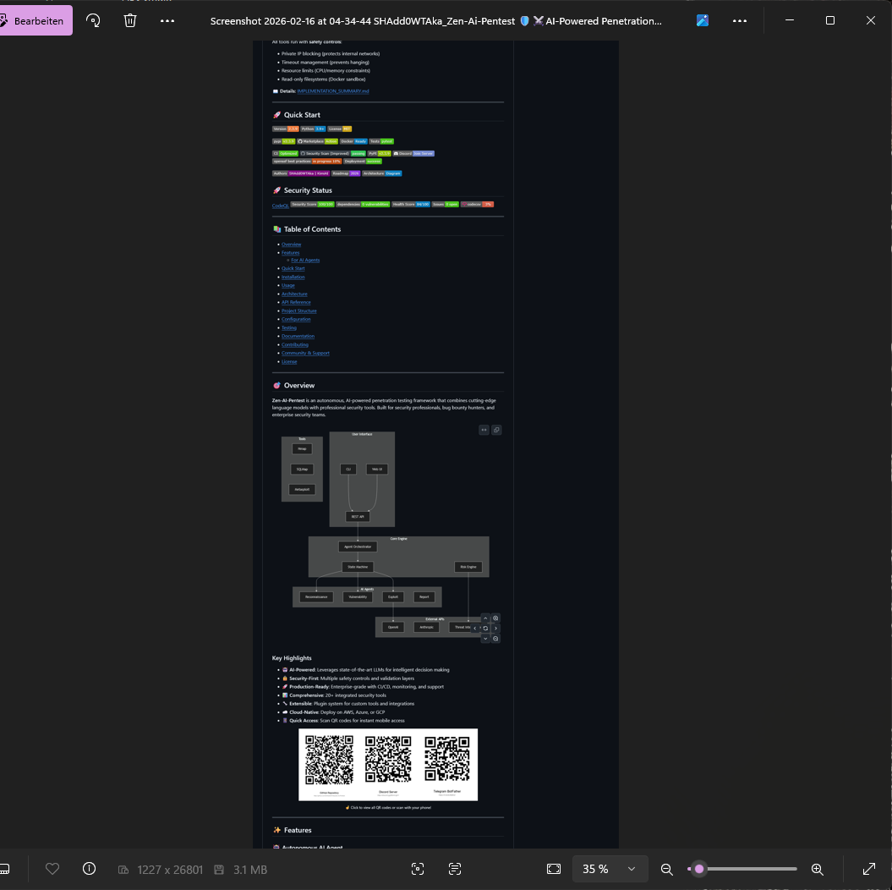
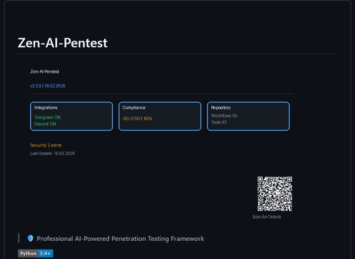

# Zen-AI-Pentest 🛡️🤖

> **Autonomous AI-Powered Penetration Testing Framework with Real Tool Execution**

[](https://python.org)
[]()
[](DOCKER.md)
[](LICENSE)
[]()
[](https://discord.gg/BSmCqjhY)

**Execute real security tools with intelligent orchestration, safety guardrails, and multi-agent cooperation.**



[Quick Start](#-quick-start) • [Features](#-features) • [Docker](#-docker-deployment) • [Documentation](#-documentation) • [Safety](#-safety-first)

---

## 🚀 Quick Start

### Option 1: Docker (Recommended) 🐳

```bash
# Clone repository
git clone https://github.com/SHAdd0WTAka/Zen-Ai-Pentest.git
cd Zen-Ai-Pentest

# Start full stack (API, Database, Agent)
docker-compose up -d

# Access API at http://localhost:8000
# API Docs at http://localhost:8000/docs
```

### Option 2: Demo Script

```bash
# Run end-to-end demo (no setup required!)
python demo_e2e.py

# Or with options
python demo_e2e.py --target scanme.nmap.org --risk-level 1
```

### Option 3: Manual Installation

```bash
# Install dependencies
pip install -r requirements.txt

# Run API server
uvicorn api.main:app --reload
```

---

## ✨ Features

### 🛡️ Security Guardrails
- **IP Validation** - Blocks private networks (10.x, 192.168.x, 172.16-31.x)
- **Domain Filtering** - Prevents localhost/internal domain scanning
- **Risk Levels** - 4 levels (SAFE → AGGRESSIVE) with tool restrictions
- **Rate Limiting** - Prevents accidental DoS

### 🤖 Multi-Agent System
- **Workflow Orchestrator** - Manages complex pentest workflows
- **Task Distribution** - Assigns tasks to available agents
- **Real-time Updates** - WebSocket communication
- **Result Aggregation** - Collects and analyzes findings

### 🔒 VPN Integration (Optional)
- **ProtonVPN Support** - Native CLI integration
- **Generic Detection** - Works with OpenVPN, WireGuard, etc.
- **Safety Warnings** - Alerts when scanning without VPN
- **Strict Mode** - Can require VPN for scans

### 🐳 Docker Ready
- **One-Command Deploy** - `docker-compose up -d`
- **Isolated Environment** - All tools pre-installed
- **Scalable** - Run multiple agents
- **Production Ready** - Health checks & monitoring

### 🧪 Real Tool Execution
- ✅ **Nmap** - Port scanning
- ✅ **Nuclei** - Vulnerability detection
- ✅ **WHOIS** - Domain information
- ✅ **DNS** - DNS enumeration
- ✅ **SQLMap** - SQL injection testing (elevated risk)
- ✅ **Subfinder** - Subdomain discovery

---

## 📊 Demo Output

```
======================================================================
🎯 ZEN-AI-PENTEST END-TO-END DEMO
======================================================================

📋 Step 1: Initializing Workflow Orchestrator
✅ Orchestrator initialized (Risk Level: NORMAL)

🤖 Step 2: Creating Mock Agent
✅ Agent demo-agent-1 connected

🚀 Step 3: Starting Workflow (Target: scanme.nmap.org)
🛡️  Target 'scanme.nmap.org' passed guardrails validation
⚠️  WARNING: Scanning without VPN protection!
✅ Workflow started: wf_024bc4af3f5c

⚙️  Step 4: Executing Tasks
🔧 Agent executing: whois on scanme.nmap.org
🔧 Agent executing: dns on scanme.nmap.org
🔧 Agent executing: nmap on scanme.nmap.org
✅ Workflow completed with state: completed

📊 Step 5: Generating Report
✅ Report saved to: pentest_report_wf_024bc4af3f5c_20260218_014511.md

======================================================================
📈 DEMO SUMMARY
======================================================================
Workflow ID:        wf_024bc4af3f5c
Target:             scanme.nmap.org
Final State:        completed
Tasks Completed:    6
Total Findings:     3

🎯 Sample Findings:
   [INFO] DNS resolution for scanme.nmap.org → 45.33.32.156
   [MEDIUM] Open ports on scanme.nmap.org: 22 (ssh), 80 (http)
```

---

## 🏗️ System Architecture

```
┌─────────────────────────────────────────────────────────────────────┐
│                         CLIENT INTERFACE                            │
├─────────────────────────────────────────────────────────────────────┤
│  ┌──────────────┐  ┌──────────────┐  ┌──────────────┐              │
│  │   🌐 Web UI  │  │   💻 CLI     │  │   🔌 API     │              │
│  │   (React)    │  │   (Python)   │  │   (REST)     │              │
│  └──────┬───────┘  └──────┬───────┘  └──────┬───────┘              │
└─────────┼─────────────────┼─────────────────┼───────────────────────┘
          │                 │                 │
          └─────────────────┼─────────────────┘
                            │ HTTPS / JWT
                            ▼
┌─────────────────────────────────────────────────────────────────────┐
│                         API GATEWAY                                 │
│                    FastAPI + WebSocket                              │
│  ┌──────────────┐ ┌──────────────┐ ┌──────────────┐                │
│  │   🔐 Auth    │ │   📋 Work-   │ │   🤖 Agent   │                │
│  │   (JWT/RBAC) │ │   flow API   │ │   Manager    │                │
│  └──────────────┘ └──────────────┘ └──────────────┘                │
└─────────────────────────┬───────────────────────────────────────────┘
                          │
                          ▼
┌─────────────────────────────────────────────────────────────────────┐
│                    WORKFLOW ORCHESTRATOR                            │
├─────────────────────────────────────────────────────────────────────┤
│  ┌──────────────┐  ┌──────────────┐  ┌──────────────┐              │
│  │   🛡️         │  │   📊 Task    │  │   ⚠️ Risk    │              │
│  │   Guardrails │  │   Queue      │  │   Levels     │              │
│  │   (IP/Domain │  │              │  │   (0-3)      │              │
│  │   Filter)    │  │              │  │              │              │
│  └──────────────┘  └──────────────┘  └──────────────┘              │
│  ┌──────────────┐  ┌──────────────┐  ┌──────────────┐              │
│  │   🔒 VPN     │  │   📈 State   │  │   📝 Report  │              │
│  │   Check      │  │   Machine    │  │   Generator  │              │
│  └──────────────┘  └──────────────┘  └──────────────┘              │
└─────────────────────────┬───────────────────────────────────────────┘
                          │ WebSocket + Task Distribution
                          ▼
┌─────────────────────────────────────────────────────────────────────┐
│                         AGENT POOL                                  │
├─────────────────────────────────────────────────────────────────────┤
│  ┌──────────────┐  ┌──────────────┐  ┌──────────────┐              │
│  │   🤖 Agent   │  │   🤖 Agent   │  │   🤖 Agent   │              │
│  │   #1         │  │   #2         │  │   #N         │              │
│  │   (Docker)   │  │   (Docker)   │  │   (Docker)   │              │
│  └──────┬───────┘  └──────┬───────┘  └──────┬───────┘              │
└─────────┼─────────────────┼─────────────────┼───────────────────────┘
          │                 │                 │
          ▼                 ▼                 ▼
┌─────────────────────────────────────────────────────────────────────┐
│                      SECURITY TOOLKIT                               │
├─────────────────────────────────────────────────────────────────────┤
│  ┌──────────┐ ┌──────────┐ ┌──────────┐ ┌──────────┐ ┌──────────┐  │
│  │   🔍     │ │   📡     │ │   🌐     │ │   ⚡     │ │   🎯     │  │
│  │   nmap   │ │  whois   │ │   dig    │ │  nuclei  │ │  sqlmap  │  │
│  │          │ │          │ │          │ │          │ │          │  │
│  └──────────┘ └──────────┘ └──────────┘ └──────────┘ └──────────┘  │
└─────────────────────────────────────────────────────────────────────┘
                          │
                          ▼
┌─────────────────────────────────────────────────────────────────────┐
│                         DATA LAYER                                  │
├─────────────────────────────────────────────────────────────────────┤
│  ┌──────────────┐  ┌──────────────┐  ┌──────────────┐              │
│  │   🐘 Postgre │  │   ⚡ Redis   │  │   📁 File    │              │
│  │   SQL        │  │   Cache      │  │   Storage    │              │
│  │   (State)    │  │   (Queue)    │  │   (Reports)  │              │
│  └──────────────┘  └──────────────┘  └──────────────┘              │
└─────────────────────────────────────────────────────────────────────┘
```

---

## 🐳 Docker Deployment

### Full Stack

```bash
# Start everything
docker-compose up -d

# Check status
docker-compose ps

# View logs
docker-compose logs -f api

# Scale agents
docker-compose up -d --scale agent=3
```

### Services

| Service | Port | Description |
|---------|------|-------------|
| API | 8000 | FastAPI server |
| PostgreSQL | 5432 | Database |
| Redis | 6379 | Cache |
| Agent | - | Pentest agent |

📖 **[Complete Docker Guide](DOCKER.md)**

---

## 🛡️ Safety First

### Default Protections

- ✅ **Private IP Blocking** - Prevents scanning 10.0.0.0/8, 172.16.0.0/12, 192.168.0.0/16
- ✅ **Loopback Protection** - Blocks 127.x.x.x and ::1
- ✅ **Local Domain Filter** - Prevents .local, .internal, localhost
- ✅ **Risk Level Control** - Restricts tools by safety level
- ✅ **Rate Limiting** - Prevents abuse

### Risk Levels

| Level | Tools | Description |
|-------|-------|-------------|
| **SAFE (0)** | whois, dns, subdomain | Reconnaissance only |
| **NORMAL (1)** | + nmap, nuclei | Standard scanning |
| **ELEVATED (2)** | + sqlmap, exploit | Light exploitation |
| **AGGRESSIVE (3)** | + pivot, lateral | Full exploitation |

⚠️ **Always ensure you have authorization before scanning!**

---

## 📚 Documentation

| Document | Description |
|----------|-------------|
| [DOCKER.md](DOCKER.md) | Docker deployment guide |
| [GUARDRAILS.md](GUARDRAILS.md) | Security guardrails documentation |
| [GUARDRAILS_INTEGRATION.md](GUARDRAILS_INTEGRATION.md) | Guardrails integration guide |
| [VPN_INTEGRATION.md](VPN_INTEGRATION.md) | VPN setup and usage |
| [DEMO_E2E.md](DEMO_E2E.md) | End-to-end demo documentation |
| [AGENTS.md](AGENTS.md) | Agent development guide |

---

## 🧪 Testing

```bash
# Run all tests
pytest

# Run specific test suites
pytest tests/test_guardrails.py -v
pytest tests/test_vpn.py -v
pytest tests/test_workflows.py -v

# Run E2E demo
python demo_e2e.py
```

**Current Status: 122 tests passing ✅**

---

## 🛠️ Development

```bash
# Setup development environment
git clone https://github.com/SHAdd0WTAka/Zen-Ai-Pentest.git
cd Zen-Ai-Pentest
python -m venv venv
source venv/bin/activate  # Windows: venv\Scripts\activate
pip install -r requirements-dev.txt

# Run in development mode
uvicorn api.main:app --reload
```

---

## 🤝 Contributing

We welcome contributions! Please see our [Contributing Guide](CONTRIBUTING.md) for details.

1. Fork the repository
2. Create your feature branch (`git checkout -b feature/amazing-feature`)
3. Commit your changes (`git commit -m 'Add amazing feature'`)
4. Push to the branch (`git push origin feature/amazing-feature`)
5. Open a Pull Request

---

## 📊 Project Activity



---

## 📄 License

This project is licensed under the MIT License - see the [LICENSE](LICENSE) file for details.

---

## 🙏 Acknowledgments

- Built with [FastAPI](https://fastapi.tiangolo.com/)
- AI powered by [Kimi AI](https://platform.moonshot.cn/)
- Security tools by the open-source community

---

## ⚠️ Disclaimer

**This tool is for authorized security testing only.** Always ensure you have explicit permission before scanning any target. The authors are not responsible for misuse or damage caused by this tool.

**Use responsibly. Test ethically. Stay safe.** 🛡️

---

<p align="center">
  Made with ❤️ by <a href="https://github.com/SHAdd0WTAka">SHAdd0WTAka</a>
</p>
