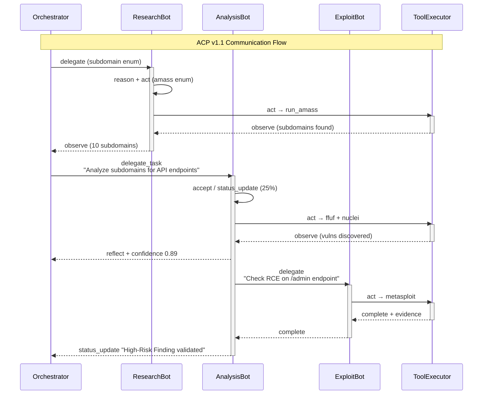

# Agent Communication Protocol (ACP) v1.1

> Standardized messaging system for multi-agent collaboration in Zen-AI-Pentest

## Overview

The Agent Communication Protocol (ACP) enables structured, real-time communication between AI agents (ResearchBot, AnalysisBot, ExploitBot, etc.) in the Zen-AI-Pentest framework.

## Features

- ✅ **Structured Messages**: Type-safe Pydantic models
- ✅ **Real-time**: WebSocket-based communication
- ✅ **Persistent**: PostgreSQL logging for audit/replay
- ✅ **Scalable**: Session-based multi-agent support
- ✅ **Type-safe**: Validation for all message formats

## Quick Start

### 1. Connect to WebSocket

```javascript
const ws = new WebSocket(
    "ws://localhost:8000/ws/agent-comm/scan_session_123?agent_id=analysis-bot-1"
);

ws.onopen = () => console.log("Connected to ACP");
ws.onmessage = (event) => {
    const msg = JSON.parse(event.data);
    handleMessage(msg);
};
```

### 2. Send Messages

```javascript
// Delegate a task
ws.send(JSON.stringify({
    message_id: "msg_001",
    version: "1.1",
    timestamp: new Date().toISOString(),
    agent_id: "analysis-bot-1",
    session_id: "scan_session_123",
    type: "delegate_task",
    priority: 1,
    content: {
        task_description: "Enumerate subdomains of target.com",
        assignee: "recon-bot-2",
        due_in_seconds: 1800
    },
    targets: ["recon-bot-2"],
    context: {
        target: "target.com",
        session_id: "scan_session_123",
        safety_level: "medium_risk"
    }
}));
```

## Message Types

| Type | Description | Use Case |
|------|-------------|----------|
| `reason` | Thought process | Agent explains its reasoning |
| `act` | Tool execution | Agent calls a tool |
| `observe` | Tool result | Agent reports tool output |
| `reflect` | Analysis | Agent evaluates findings |
| `delegate` | Simple delegation | Pass task to another agent |
| `delegate_task` | Complex delegation | Pass task with parameters |
| `status_update` | Progress report | Update on ongoing work |
| `error` | Error report | Something went wrong |
| `complete` | Task complete | Work finished successfully |
| `cancel` | Cancellation | Stop current task |

## Architecture



## Message Schema

### Core Message Structure

```json
{
  "message_id": "msg_k7p9m4x2",
  "version": "1.1",
  "timestamp": "2026-02-13T14:42:19.337Z",
  "agent_id": "analysis-bot-4",
  "session_id": "scan_xyz789",
  "type": "delegate_task",
  "priority": 1,
  "content": {
    "task_description": "Perform deep enumeration on api.target.com",
    "assignee": "recon-bot-2",
    "due_in_seconds": 1800,
    "parameters": {
      "max_depth": 3,
      "wordlist": "raft-medium-directories.txt"
    }
  },
  "targets": ["orchestrator", "recon-bot-2"],
  "context": {
    "target": "api.target.com",
    "session_id": "scan_xyz789",
    "risk_score": 6.2,
    "safety_level": "medium_risk"
  },
  "correlation_id": "corr_del_001",
  "ttl_seconds": 3600
}
```

### Field Descriptions

| Field | Type | Description |
|-------|------|-------------|
| `message_id` | string | Unique ID (format: `msg_[a-z0-9]{8,12}`) |
| `version` | string | Protocol version (always "1.1") |
| `timestamp` | ISO8601 | Message creation time |
| `agent_id` | string | Sending agent identifier |
| `session_id` | string | Scan/test session ID |
| `type` | enum | Message type (see table above) |
| `priority` | int | 0=CRITICAL, 1=HIGH, 2=NORMAL, 3=LOW, 4=BACKGROUND |
| `content` | object | Message payload (varies by type) |
| `targets` | array | Recipient agent IDs |
| `context` | object | Execution context (target, safety_level, etc.) |
| `correlation_id` | string | Links request-response pairs |
| `ttl_seconds` | int | Message lifetime (default: 3600) |

## Python API

### Creating Messages

```python
from agent_comm.models import AgentMessage, MessageContent, MessageContext, MessageTemplates

# Method 1: Manual creation
msg = AgentMessage(
    message_id="msg_001",
    agent_id="analysis-bot-1",
    session_id="scan_123",
    type="delegate_task",
    priority=1,
    content=MessageContent(
        task_description="Enumerate subdomains",
        assignee="recon-bot-2",
        due_in_seconds=1800
    ),
    targets=["recon-bot-2"],
    context=MessageContext(
        target="example.com",
        session_id="scan_123",
        safety_level="medium_risk"
    )
)

# Method 2: Using template
msg = MessageTemplates.create_delegate_task(
    agent_id="analysis-bot-1",
    session_id="scan_123",
    task_description="Enumerate subdomains",
    assignee="recon-bot-2",
    target="example.com",
    due_in_seconds=1800
)
```

### Database Logging

```python
from database.models.agent_comm_log import AgentCommLog

# Log incoming message
log_entry = AgentCommLog.from_message(msg)
db.add(log_entry)
db.commit()

# Query logs
logs = db.query(AgentCommLog).filter(
    AgentCommLog.session_id == "scan_123"
).order_by(AgentCommLog.timestamp.desc()).all()
```

## WebSocket API

### Endpoint

```
ws://localhost:8000/ws/agent-comm/{session_id}?agent_id={agent_id}
```

### Query Parameters

| Parameter | Required | Description |
|-----------|----------|-------------|
| `agent_id` | Yes | Unique agent identifier |

### HTTP Endpoints

```
GET /ws/agent-comm/sessions/{session_id}/agents
```

Returns list of connected agents in session.

## Implementation Files

| File | Description |
|------|-------------|
| `agent_comm/models.py` | Pydantic models for messages |
| `database/models/agent_comm_log.py` | SQLAlchemy database model |
| `api/websockets/agent_comm.py` | WebSocket endpoint |
| `docs/AGENT_COMMUNICATION_PROTOCOL.md` | This documentation |

## Security Considerations

1. **Authentication**: WebSocket connections should validate agent_id
2. **Authorization**: Agents should only access their own sessions
3. **Rate Limiting**: Implement limits to prevent spam
4. **Input Validation**: All messages validated via Pydantic
5. **Audit Trail**: All messages logged to PostgreSQL

## Future Enhancements (v1.2)

- [ ] End-to-end encryption for sensitive findings
- [ ] Message compression for large observations
- [ ] Dead-letter queue for failed deliveries
- [ ] Pub/Sub topics (e.g., "high_risk_only")
- [ ] Message replay capability

## References

- [Pydantic Documentation](https://docs.pydantic.dev/)
- [FastAPI WebSockets](https://fastapi.tiangolo.com/advanced/websockets/)
- [SQLAlchemy JSON Type](https://docs.sqlalchemy.org/en/20/core/type_basics.html#sqlalchemy.types.JSON)

---

*Last Updated: 13.02.2026*  
*Protocol Version: 1.1*
