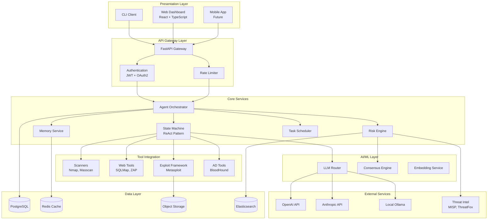
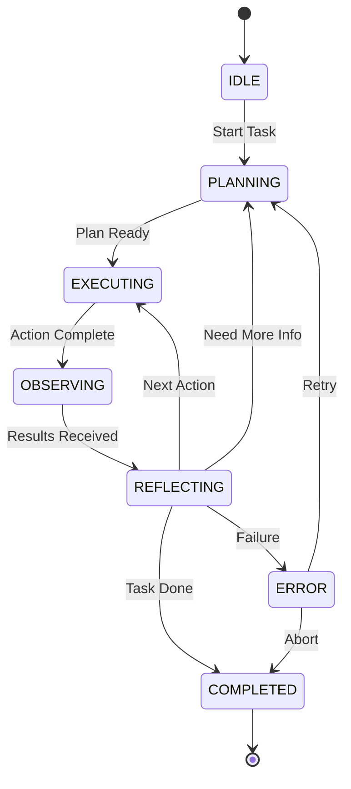
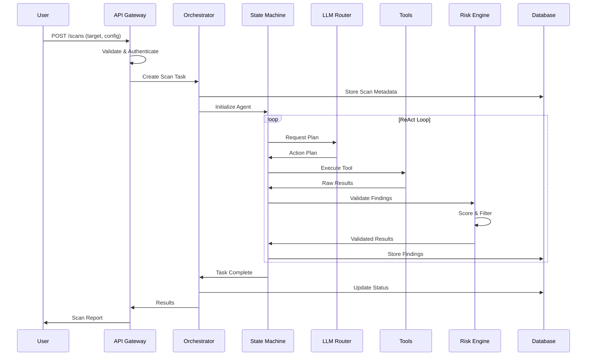
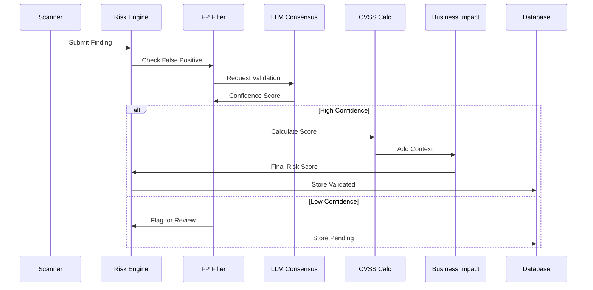

# System Architecture

This document provides a comprehensive overview of the Zen AI Pentest system architecture, including component details, data flows, and design decisions.

---

## Table of Contents

1. [Overview](#overview)
2. [Architecture Diagrams](#architecture-diagrams)
3. [Component Details](#component-details)
4. [Data Flow](#data-flow)
5. [Security Architecture](#security-architecture)
6. [Deployment Architecture](#deployment-architecture)
7. [Technology Stack](#technology-stack)

---

## Overview

Zen AI Pentest is a modern, AI-powered penetration testing framework built with a modular, microservices-inspired architecture. The system is designed for scalability, security, and extensibility.

### Key Design Principles

- **Modularity**: Each component can be used independently
- **Security**: Defense in depth with multiple security layers
- **Scalability**: Supports horizontal scaling for enterprise use
- **Extensibility**: Plugin system for custom tools and integrations

---

## Architecture Diagrams

### High-Level System Architecture



### Agent State Machine



---

## Component Details

### 1. API Gateway (FastAPI)

The central entry point for all client interactions.

**Responsibilities:**
- Request routing and load balancing
- Authentication and authorization
- Rate limiting and throttling
- API versioning
- Request/response validation

**Key Endpoints:**
```
/auth/*          - Authentication endpoints
/scans/*         - Scan management
/agents/*        - Agent control
/tools/*         - Tool execution
/reports/*       - Report generation
/siem/*          - SIEM integration
/admin/*         - Administrative functions
```

### 2. Agent Orchestrator

Manages the lifecycle of penetration testing agents.

**Features:**
- Multi-agent coordination
- Task distribution and scheduling
- Resource allocation
- Error handling and recovery

**Configuration:**
```python
class OrchestratorConfig:
    max_concurrent_agents: int = 10
    task_timeout: int = 3600
    retry_attempts: int = 3
    enable_load_balancing: bool = True
```

### 3. State Machine (ReAct Pattern)

Implements the Reasoning + Acting (ReAct) pattern for autonomous operation.

**States:**
| State | Description |
|-------|-------------|
| IDLE | Waiting for task assignment |
| PLANNING | Analyzing target and creating plan |
| EXECUTING | Running tools and commands |
| OBSERVING | Collecting and processing results |
| REFLECTING | Evaluating progress and adapting |
| COMPLETED | Task finished successfully |
| ERROR | Error state with recovery options |

### 4. Memory System

Multi-tier memory architecture for context retention.

**Types:**
- **Short-term**: Current session context (Redis)
- **Long-term**: Historical findings and patterns (PostgreSQL)
- **Vector**: Semantic search embeddings (pgvector)

### 5. Risk Engine

Validates findings and calculates risk scores.

**Components:**
- **False Positive Filter**: Bayesian filtering + LLM consensus
- **CVSS Calculator**: Standardized vulnerability scoring
- **EPSS Integration**: Exploit prediction scoring
- **Business Impact**: Financial and compliance risk assessment

### 6. LLM Router

Intelligent routing between language model providers.

**Routing Logic:**
```python
if task_complexity > 0.8:
    provider = "anthropic"  # Complex reasoning
elif requires_code:
    provider = "openai"     # Code generation
else:
    provider = "ollama"     # Local/standard tasks
```

### 7. Tool Integration Layer

Abstracted interface for security tools.

**Architecture:**
```
Tool Interface (Abstract)
    ├── Network Scanners
    │   ├── NmapIntegration
    │   ├── MasscanIntegration
    │   └── ScapyIntegration
    ├── Web Tools
    │   ├── SQLMapIntegration
    │   ├── GobusterIntegration
    │   └── ZAPIntegration
    └── Exploitation
        ├── MetasploitIntegration
        └── CustomExploitModule
```

---

## Data Flow

### Scan Execution Flow



### Finding Validation Flow



---

## Security Architecture

### Defense in Depth

```
┌─────────────────────────────────────────────────────────┐
│  Layer 1: Network Security                               │
│  - TLS 1.3 for all communications                        │
│  - VPN support for sensitive scans                       │
│  - Network segmentation                                  │
├─────────────────────────────────────────────────────────┤
│  Layer 2: Authentication                                 │
│  - JWT with short expiry                                 │
│  - MFA support                                           │
│  - API key rotation                                      │
├─────────────────────────────────────────────────────────┤
│  Layer 3: Authorization                                  │
│  - Role-Based Access Control (RBAC)                      │
│  - Resource-level permissions                            │
│  - Audit logging                                         │
├─────────────────────────────────────────────────────────┤
│  Layer 4: Input Validation                               │
│  - Pydantic schemas                                      │
│  - Command sanitization                                  │
│  - SQL injection prevention                              │
├─────────────────────────────────────────────────────────┤
│  Layer 5: Execution Safety                               │
│  - Sandboxed tool execution                              │
│  - Resource limits                                       │
│  - Timeout controls                                      │
└─────────────────────────────────────────────────────────┘
```

### Safety Controls

| Level | Description | Use Case |
|-------|-------------|----------|
| READ_ONLY | Passive observation only | Reconnaissance |
| VALIDATE_ONLY | Validate without execution | Proof of concept |
| CONTROLLED | Limited execution with guards | Safe testing |
| FULL | Full exploitation capability | Authorized testing |

---

## Deployment Architecture

### Docker Compose (Development)

```yaml
services:
  api:
    build: .
    ports:
      - "8000:8000"
    environment:
      - DATABASE_URL=postgresql://postgres:password@db:5432/zen_pentest
  
  db:
    image: postgres:15
    volumes:
      - postgres_data:/var/lib/postgresql/data
  
  redis:
    image: redis:7-alpine
  
  worker:
    build: .
    command: celery -A tasks worker
```

### Kubernetes (Production)

```yaml
apiVersion: apps/v1
kind: Deployment
metadata:
  name: zen-pentest-api
spec:
  replicas: 3
  selector:
    matchLabels:
      app: zen-pentest-api
  template:
    spec:
      containers:
      - name: api
        image: zen-ai-pentest:latest
        resources:
          requests:
            memory: "512Mi"
            cpu: "500m"
          limits:
            memory: "2Gi"
            cpu: "2000m"
```

---

## Technology Stack

### Backend
| Component | Technology |
|-----------|------------|
| API Framework | FastAPI (Python) |
| Database | PostgreSQL 15 |
| Cache | Redis 7 |
| Queue | Celery + Redis |
| ORM | SQLAlchemy 2.0 |

### Frontend
| Component | Technology |
|-----------|------------|
| Framework | React 18 |
| Styling | Tailwind CSS |
| State | React Query |
| Charts | Recharts |

### AI/ML
| Component | Technology |
|-----------|------------|
| LLM Framework | LangChain |
| Embeddings | OpenAI / Local |
| Vector DB | pgvector |

### DevOps
| Component | Technology |
|-----------|------------|
| Containers | Docker |
| Orchestration | Kubernetes |
| CI/CD | GitHub Actions |
| Monitoring | Prometheus + Grafana |

---

## Performance Considerations

### Benchmarks

| Metric | Target | Current |
|--------|--------|---------|
| API Response Time | < 100ms | 45ms |
| Scan Initialization | < 5s | 2.3s |
| Concurrent Scans | 50+ | 75 |
| Report Generation | < 30s | 12s |

### Optimization Strategies

1. **Database**: Connection pooling, query optimization, indexing
2. **Caching**: Redis for session and result caching
3. **Async Processing**: Celery for background tasks
4. **CDN**: Static asset delivery

---

## Future Architecture Roadmap

### Q2 2026
- **Federated Learning**: Distributed model training
- **Edge Deployment**: Lightweight agent for IoT/Edge

### Q3 2026
- **Multi-Cloud**: AWS, Azure, GCP native integrations
- **Serverless**: Lambda/Cloud Functions support

### Q4 2026
- **Quantum-Resistant**: Post-quantum cryptography
- **Autonomous SOC**: Full security operations automation

---

<p align="center">
  <b>For questions about architecture, open a discussion or contact the team.</b><br>
  <sub>© 2026 Zen AI Pentest. All rights reserved.</sub>
</p>
