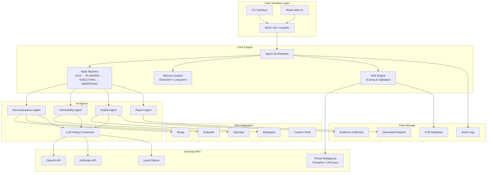

# Zen AI Pentest Architecture

## System Architecture Diagram

## Component Overview

### 1. User Interface Layer
- **CLI**: Command-line interface for scripting and automation
- **REST API**: FastAPI-based backend for web integration
- **Web UI**: React-based dashboard for interactive use

### 2. Core Engine
- **Agent Orchestrator**: Manages multi-agent workflow and task distribution
- **State Machine**: Implements ReAct pattern (Reason → Act → Observe → Reflect)
- **Memory System**: Maintains context across sessions
- **Risk Engine**: Validates findings and calculates risk scores

### 3. AI Agents
Specialized agents for different penetration testing phases:
- **Reconnaissance**: Network scanning and enumeration
- **Vulnerability**: Identifies security weaknesses
- **Exploit**: Attempts controlled exploitation
- **Report**: Generates comprehensive reports

### 4. Tool Integration
Integrates with industry-standard security tools:
- Nmap, Gobuster, SQLMap, Metasploit
- Custom exploitation modules

### 5. External APIs
- **LLM Providers**: OpenAI, Anthropic, Local Ollama
- **Threat Intelligence**: Real-time threat data

## Data Flow

1. User input → API → Orchestrator
2. Orchestrator selects appropriate agent
3. Agent uses tools and AI consensus
4. Results validated by Risk Engine
5. Evidence collected and reports generated
